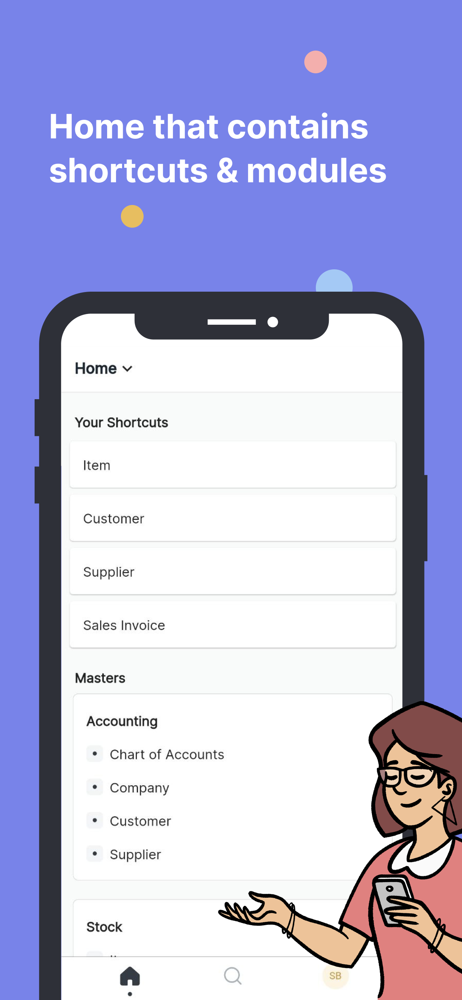
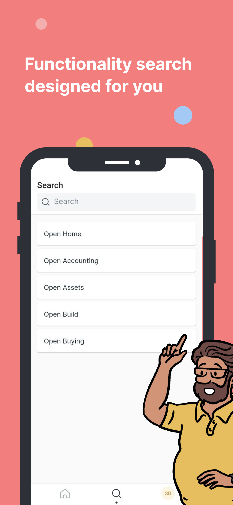
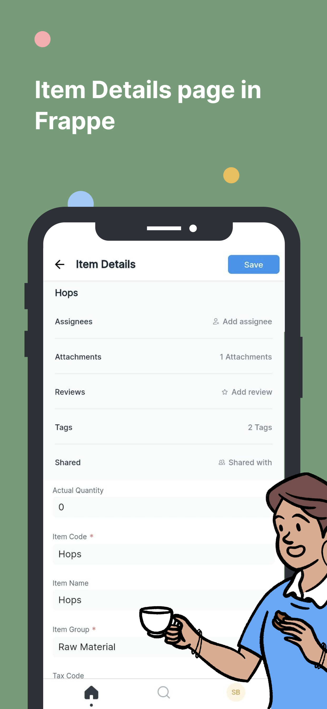

# Frappe Mobile

Access your ERPNext desk or any other Frappe desk anytime from your smartphone.

<kbd></kbd>
<kbd></kbd>
<kbd></kbd>

## Features:
1) Create/Update Docs
2) Add/Remove Assignees, Tags
3) Add/Remove/Download Attachments 
4) Add Comments, Send Email
5) Appreciate/Criticize Users involved in specified Doc.
6) Timeline
7) Awesombar


## Development
0) To run this Project first you need to [Setup Flutter](https://flutter.dev/docs/get-started/install)

1) Install packages<br/>
```sh
flutter pub get
```
2) Run the Project<br/>
```sh
flutter run
```

### Architecture

This Project roughly follows MVVM Architecture where each screen has seperate file and each stateful screen is contained in a folder with 2 files 

1) View file (layout logic) 
2) View Model File (data processing and state management). 

This Project uses [provider](https://pub.dev/packages/provider) for State Management. 
[hive](https://pub.dev/packages/hive), [shared_preferences](https://pub.dev/packages/shared_preferences) for storage. 
[dio](https://pub.dev/packages/dio) for making network requests.
